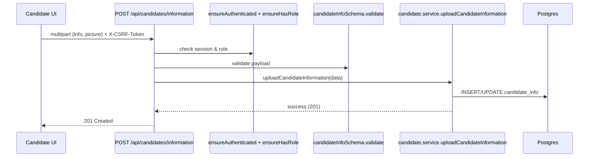
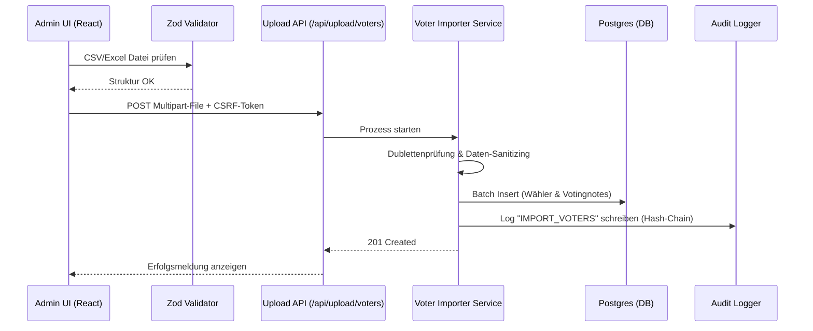
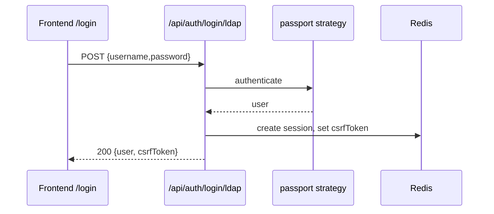

# HKA Online-Wahlsystem: Umfassendes Benutzer- und Administrationshandbuch

**Version:** 1.0

**Stand:** 14. Januar 2026

Dieses Handbuch bietet eine lückenlose Dokumentation des HKA E-Voting Systems – von der technischen Bereitstellung über die tägliche Nutzung durch Wähler und Kandidaten bis hin zur revisionssicheren Administration.

---

### 📌 Wichtige Eckpunkte auf einen Blick

* **Sicherheit & Anonymität:** Das System arbeitet BSI-konform. Stimmen werden kryptografisch gehasht und strikt von der Identität der Wähler getrennt gespeichert.
* **Zugang:** Erreichbar über das Campus-Netz/VPN.
* **Wähler-Frontend:** `http://localhost:5173`
* **Admin-Frontend:** `http://localhost:5174`
* **Backend:** `http://localhost:3000`
* **Support:** Bei technischen Fragen oder Störungen kontaktieren Sie bitte **Prof. Dr. Rainer Neumann**.

---

## Inhaltsverzeichnis

1. [Einführung](#1-einführung)
2. [Voraussetzungen und Systemstart](#2-voraussetzungen-und-systemstart)
3. [Anmeldung (Login-Verfahren)](#3-anmeldung-login-verfahren)
4. [Wähler-Ansicht: Wahlvorgang und Benutzerführung](#4-wähler-ansicht-wahlvorgang-und-benutzerführung)
5. [Kandidaten-Ansicht: Profil verwalten](#5-kandidaten-ansicht-profil-verwalten)
6. [Admin-Ansicht: Wahlen einrichten, verwalten und auswerten](#6-admin-ansicht-wahlen-einrichten-verwalten-und-auswerten)
   * 6.1 [Übersicht &amp; Navigation](#61-übersicht--navigation)
   * 6.2 [Die Menüstruktur im Detail](#62-die-menüstruktur-im-detail)
   * 6.3 [Dokumentation: Audit Logs (Revisionssicherheit)](#63-dokumentation-audit-logs-revisionssicherheit)
   * 6.4 [Admin-Seite: Detaillierte Bedienungsanleitung](#64-admin-seite-detaillierte-bedienungsanleitung)
     * 6.4.1 [VERWALTUNG: Datenbank leeren](#641-verwaltung-datenbank-leeren)
     * 6.4.2 [TESTWAHLEN: Steuern (2.1) &amp; Auszählen (2.2)](#642-testwahlen-steuern-21--auszählen-22)
     * 6.4.3 [WAHLEN DEFINIEREN: Vorlagen &amp; Upload](#643-wahlen-definieren-vorlagen--upload)
     * 6.4.4 [WÄHLERVERZEICHNIS: Export (4.1) &amp; Import (4.2)](#644-wählerverzeichnis-export-41--import-42)
     * 6.4.5 [KANDIDATENVERZEICHNIS: Import (5.1) &amp; Export (5.2)](#645-kandidatenverzeichnis-import-51--export-52)
     * 6.4.6 [AUSZÄHLUNG: Wahlergebnisse (6)](#646-auszählung-wahlergebnisse-6)
7. [Technische Details &amp; Entwicklerdokumentation](#7-technische-details--entwicklerdokumentation)
   * 7.1 [Technik-Deep-Dive: Architektur der Wähler-Oberfläche](#71-technik-deep-dive-architektur-der-wähler-oberfläche)
   * 7.2 [Technik-Deep-Dive: Architektur der Admin-Oberfläche](#72-technik-deep-dive-architektur-der-admin-oberfläche)
   * 7.3 [Technik-Deep-Dive: Backend-Architektur &amp; API-Endpunkte](#73-technik-deep-dive-backend-architektur--api-endpunkte)
8. [Häufig gestellte Fragen (FAQ)](#8-häufig-gestellte-fragen-faq)

---

## 1. Einführung

Das HKA E-Voting System ist eine webbasierte Plattform zur sicheren und transparenten Durchführung akademischer Wahlen an der Hochschule Karlsruhe. Es bildet den gesamten Wahlprozess digital ab – von der flexiblen Kandidatenverwaltung über komplexe Abstimmungsmodi (Kumulieren/Panaschieren) bis hin zur automatisierten, rechtskonformen Ergebnisauszählung.

### 1.1 Kernfunktionen

* **Integrität:** Revisionssichere Audit-Logs und kryptografische Stimmabsicherung.
* **Flexibilität:** Dynamischer Import/Export via Excel/CSV.
* **Präzision:** Implementierung anerkannter Auszählungsalgorithmen (z. B. Sainte-Laguë).
* **Inklusivität:** Barrierefreie Benutzeroberfläche und responsives Design für mobile Endgeräte.

### 1.2 Rollenmodell

* **`voter` (Wähler):** Standardrolle. Kann Wahlen einsehen, abstimmen und als Kandidat das eigene Profil pflegen.
* **`admin` (Administrator):** Volle Systemkontrolle (Importe, Datenbank-Resets, Audit-Log-Einsicht).

*Hinweis: Rollen werden über LDAP/Passport zugewiesen oder über lokale Secrets (`readSecret`) definiert.*

---

## 2. Voraussetzungen und Systemstart

### 2.1 Systemanforderungen

* **Endgerät:** PC, Tablet oder Smartphone mit Internetzugang.
* **Browser:** Aktuelle Version von Chrome oder Firefox (Cookies müssen für die Session-Verwaltung aktiviert sein).
* **Für Betreiber:** Docker-Umgebung und Node.js (v18+).

### 2.2 Technisches Setup & Start (Lokale Umgebung)

1. **Repository beziehen:** `git clone Repo-URL`
2. **Umgebungsvariablen:** `.env.example` im Root-Verzeichnis sowie in `backend/.extras/compose/` als `.env` kopieren und Werte anpassen (z. B. `DB_PASSWORD`, `AUTH_PROVIDER=ldap`).
3. **Abhängigkeiten installieren:** Führen Sie `npm install` jeweils in den Verzeichnissen `backend/`, `frontend/` und `admin-frontend/` aus.
4. **Infrastruktur starten:** Starten Sie die PostgreSQL-Datenbank via Docker:

```bash
cd backend/.extras/compose/postgres/ && docker-compose up -d
```

5. **Gesamtsystem starten:** Im Root-Verzeichnis: `docker-compose up -d`.
6. **Erreichbarkeit prüfen:**

* Wähler-UI: `http://localhost:5173`
* Admin-UI: `http://localhost:5174/admin`
* Health-Check API: `http://localhost:3000/health` (Status "ok" erwartet).

**Quick Commands für die Entwicklung:**

```bash

# Backend (Port 3000)

cd backend && npm start

# Frontend (Port 5173)

cd frontend && npm run dev

# Admin-Frontend (Port 5174)

cd admin-frontend && npm run dev

```

---

## 3. Anmeldung (Login-Verfahren)

Der Zugang zum Wahlsystem erfolgt sicher über die offizielle **HKA-RZ-Kennung**. Das System validiert im Hintergrund automatisch die Wahlberechtigung anhand des hinterlegten Wählerverzeichnisses und weist dem Benutzer die entsprechenden Wahlgänge (z. B. Studierendenparlament oder Fakultätsrat) zu.

### 3.1 Schritt-für-Schritt-Anleitung (Wähler & Administratoren)

1. **Aufruf der Portalseite:** Nach dem Laden der URL erscheint das zentrale Login-Fenster mit dem HKA-Logo und der Aufforderung: *"Bitte melden Sie sich mit Ihren Anmeldedaten an."*
2. **Eingabe der Anmeldedaten:**

* **Benutzername:** Geben Sie Ihr persönliches RZ-Benutzerkürzel ein (z. B. `abcd1234`).
* **Passwort:** Geben Sie Ihr zugehöriges Passwort ein.

3. **Authentifizierung:** Durch Klick auf den roten Button **"Anmelden"** wird der Prozess gestartet.
4. **Weiterleitung nach Rollenprüfung:**

* **Wähler:** Direkte Weiterleitung zur Wahl-Übersicht (Dashboard).
* **Kandidaten:** Erhalten zusätzlich Zugriff auf die Profilverwaltung ("Kandidaten-Ansicht").
* **Administratoren:** Bei Nutzung der spezifischen Admin-URL erfolgt der Zugriff auf das Verwaltungs-Dashboard (lokale Admin-Accounts werden über die `.env`-Konfiguration definiert).

---

## 4. Wähler-Ansicht: Wahlvorgang und Benutzerführung

Dieser Abschnitt erläutert, wie Wähler ihre Stimme sicher, geheim und intuitiv abgeben können. Das System wurde so entwickelt, dass es den Wähler interaktiv durch den Prozess führt und Fehler bei der Stimmabgabe proaktiv verhindert.

### 4.1 Zugang und Systemumgebung

* **System-Adressen:**
* **Lokale Testumgebung:** `http://localhost:5173`
* **Produktionsumgebung:** Offizielle HKA-Wahl-URL
* **Authentifizierung:** Der Login erfolgt über die RZ-Kennung. Das System prüft unmittelbar nach der Anmeldung im Wählerverzeichnis, für welche Gremien (z. B. StuPa, Fakultätsrat) Sie stimmberechtigt sind.

#### Technische Implementierung

Die Wähler-Oberfläche basiert auf React und ist modular in `frontend/src` aufgebaut.

* **Zentrale Komponenten:**
* `Login.jsx`: Einstiegspunkt für die Authentifizierung.
* `Home.jsx`: Zentrale Wahlübersicht (Dashboard).
* `CandidatePage.jsx`: Interaktiver Stimmzettel mit Kandidatendetails.
* `AuthContext.jsx`: Verwaltung der Sitzung und Sicherheitstoken.
* `api.js`: Zentrale Axios-Instanz zur Kommunikation mit dem Backend inkl. CSRF-Management.

---

### 4.2 Die Wahl-Übersicht (Dashboard)

Nach erfolgreicher Anmeldung werden Sie automatisch zum Dashboard (`/home`) geleitet. Hier werden alle für Sie relevanten Wahlgänge über den Endpunkt `GET /api/voter/:voterUid/elections` geladen.

Das Dashboard unterteilt Wahlen in drei übersichtliche Kategorien:

1. **Aktive Wahlen:** Laufende Wahlgänge, bei denen Sie über die Schaltfläche **"Jetzt wählen"** direkt abstimmen können.
2. **Zukünftige Wahlen:** Geplante Wahlgänge, deren Zeitraum noch nicht begonnen hat.
3. **Beendete Wahlen:** Eine Historie Ihrer Teilnahme sowie abgeschlossene Wahlen.

* **Besonderheit:** In der Benutzeroberfläche wird das Flag `isCandidate` ausgewertet. Sollten Sie selbst als Kandidat registriert sein, erscheint zusätzlich die Option **"Kandidateninfo bearbeiten"**.

---

### 4.3 Der digitale Stimmzettel (Wahlvorgang)

Durch Auswahl einer aktiven Wahl öffnet sich die Detailseite des Stimmzettels. Hier erfolgt die eigentliche Wahlhandlung.

#### 4.3.1 Kandidaten-Profile (Informations-Modals)

Durch das Klicken auf "Informationen" öffnet sich eine Liste mit den Wahlmöglichekeiten dieser Wahl.

Um eine informierte Entscheidung zu ermöglichen, können Sie durch Klick auf den Namen oder das Bild eines Kandidaten ein Detail-Fenster öffnen. Dieses enthält:

* Ein aktuelles Porträtfoto.
* Die Fakultätszugehörigkeit.
* Einen persönlichen Vorstellungstext oder das Wahlprogramm des Kandidaten.

#### 4.3.2 Aufbau und Steuerung

* **Wahlregeln:** Am oberen Rand finden Sie verbindliche Anweisungen (z. B. *"Sie haben insgesamt 3 Stimmen. Sie können einem Kandidaten maximal 3 Stimmen geben"*).
* **Kandidaten-Präsentation:** Kandidaten werden je nach Konfiguration nach Listen gruppiert oder alphabetisch sortiert dargestellt.
* **Stimmenvergabe:** Die Stimmen können intuitiv über Steuerungselemente (Pfeiltasten "hoch" und "runter") neben den Kandidatennamen verteilt werden. Dadurch erhöht/reduziert sich die Zahl, welche zu Begin 0 beträgt.

#### 4.3.3 Echtzeit-Validierung

Das System nutzt die `checkIfNumberOfVotesIsValid`-Logik, um Ihre Eingaben noch im Browser zu prüfen:

* **Sperrmechanismus:** Wenn Sie versuchen, mehr Stimmen als zulässig zu vergeben, verhindert das System die Eingabe.
* **Dynamische Freigabe:** Die Schaltfläche **"Stimme abgeben"** wird erst dann aktiv, wenn Ihre Auswahl exakt den Wahlregeln entspricht.

---

### 4.4 Stimmabgabe und Anonymität

Sobald Sie Ihre Auswahl getroffen haben und auf "Abstimmung bestätigen" auf dem Kontroll-Fenster klicken, startet der kryptografische Absicherungsprozess.

#### 4.4.1 Übermittlung (Backend-Kommunikation)

Das Frontend sendet die Daten als JSON-Payload an `POST /api/voter/:voterUid/ballot`.

* **Sicherheit:** Jede Abgabe enthält den `X-CSRF-Token` aus dem `localStorage`.
* **Bestätigung:** Nach erfolgreicher Speicherung (HTTP 201) zeigt die UI eine Bestätigungsmeldung an.

#### 4.4.2 Das Wahlgeheimnis (BSI-Konformität)

Das System stellt sicher, dass Ihre Identität und Ihre Wahlentscheidung niemals zusammengeführt werden können:

1. **Identitätstrennung:** Ihre RZ-Kennung wird unmittelbar nach der Prüfung der Wahlberechtigung von der Stimmabgabe entkoppelt.
2. **Verschlüsselung:** In der Datenbank wird lediglich markiert, *dass* Sie gewählt haben, aber nicht, *was* Sie gewählt haben.
3. **Ballot-Hash (Prüfcode):** Nach Abschluss erhalten Sie einen anonymen Hash-Code. Dieser dient als digitaler "Einwurfbeleg". Er beweist, dass Ihre Stimme im System eingegangen ist, lässt aber keine Rückschlüsse auf Ihre Identität oder Wahlentscheidung zu.

---

### 4.5 Barrierefreiheit und smarte Zusatzfunktionen

Das HKA E-Voting System wurde so entwickelt, dass wirklich jeder unkompliziert und komfortabel an der Wahl teilnehmen kann. Über das **Barrierefreiheits-Menü** (Männchen-Icon oben rechts) lassen sich folgende Funktionen individuell zuschalten:

* **Responsives Design für maximale Freiheit:** Ganz gleich, ob am Desktop-PC, auf dem Tablet im Café oder schnell zwischendurch auf dem Smartphone – die Oberfläche passt sich perfekt Ihrem Gerät an.
* **Schonender Dark Mode:** Mit nur einem Klick aktivieren Sie das dunkle Design. Das schont nicht nur Ihre Augen bei schlechten Lichtverhältnissen, sondern reduziert auch die Belastung bei längerer Bildschirmnutzung.
* **Optimale Lesbarkeit:** Sie benötigen eine größere Darstellung? Die Schriftgröße und Zeilenabstände lassen sich flexibel vergrößern, um ein ermüdungsfreies Lesen aller Kandidatenprofile zu ermöglichen.
* **Kontrast-Modus:** Für eine noch klarere Abgrenzung von Texten und Schaltflächen können Sie den Hochkontrast-Modus aktivieren.

---

## 5. Kandidaten-Ansicht: Profil verwalten

In diesem Bereich können Sie als registrierte Kandidatin oder registrierter Kandidat Ihr öffentliches Profil gestalten. Die hier hinterlegten Informationen (Profilbild und Beschreibung) sind für alle Wahlberechtigten in der Detailansicht des Stimmzettels sichtbar.

### 5.1 Zugriff auf die Kandidaten-Verwaltung

Nach der Anmeldung im System befinden Sie sich standardmäßig in der Wähleransicht.

* **Navigation:** Klicken Sie in der roten Kopfzeile auf die Schaltfläche **"Kandidaten Ansicht →"**, um zu Ihrem persönlichen Verwaltungsbereich zu gelangen.
* **Status-Check:** In der Kopfzeile links wird Ihr Benutzername (z. B. `u002`) sowie Ihre aktuell aktive Rolle zur Kontrolle angezeigt.

---

### 5.2 Profilbild verwalten

Im Bereich **"Profilbild Verwaltung"** können Sie ein Foto und einen Text hochladen, das in der Kandidatenliste und im Detail-Modal erscheint.

#### 5.2.1 Bild hochladen

* **Datei wählen:** Klicken Sie auf die rote Schaltfläche **"Datei auswählen"** oder ziehen Sie eine Bilddatei per Drag-and-Drop direkt in das markierte Feld.
* **Anforderungen:** * **Formate:** PNG oder JPG.
* **Dateigröße:** Maximal 5 MB.
* **Format:** Ein Seitenverhältnis von 3:4 wird empfohlen.

#### 5.2.2 Bild zuschneiden (Integrierter Editor)

Nach der Auswahl eines Bildes öffnet sich automatisch der Editor **"Bild zuschneiden"**:

* **Zoom:** Über den Schieberegler unter dem Vorschaubild können Sie den Zoom (bis zu 300 %) stufenlos anpassen.
* **Ausschnitt:** Verschieben Sie das Bild innerhalb des Rasters mit der Maus oder dem Touchscreen, um den gewünschten Fokus zu setzen.
* **Abschluss:** Klicken Sie auf **"Übernehmen"**, um die Bearbeitung zu sichern, oder auf **"Abbrechen / Neu wählen"**, um den Vorgang zu verwerfen.

---

### 5.3 Persönliche Beschreibung

In der Sektion **"Persönliche Beschreibung"** können Sie einen individuellen Text hinterlegen, um sich den Wählern vorzustellen (z. B. Wahlprogramm oder Motivation).

* **Eingabe:** Geben Sie Ihren Text direkt in das vorgesehene Textfeld ein.
* **Zeichenlimit:** Es stehen maximal **200 Zeichen** zur Verfügung.
* **Kontrolle:** Ein Echtzeit-Zähler unten rechts am Eingabefeld zeigt Ihnen die verbleibende Zeichenanzahl an.

---

### 5.4 Daten speichern oder unwiderruflich löschen

Am unteren Ende der Seite finden Sie die zentralen Aktions-Buttons zur Datenverwaltung:

* **Beschreibung speichern:** Über diese rote Schaltfläche sichern Sie Ihre Texteingaben dauerhaft im System.
* **Bisherige Informationen löschen!:** Falls Sie Ihr Profilbild und Ihre Beschreibung entfernen möchten, nutzen Sie diesen Button.
* **Achtung:** Diese Aktion löscht die Daten sofort und unwiderruflich vom Server.

---

### 5.5 Zusatzfunktionen und Sitzungsbeenden

* **Barrierefreiheit:** Über das Männchen-Symbol in der Kopfzeile können Sie jederzeit die visuellen Anpassungsoptionen aufrufen.
* **Navigation:** Über den Button **"← Hauptansicht"** gelangen Sie zurück zur allgemeinen Wahlübersicht für Wähler.
* **Abmelden:** Ein Klick auf **"Abmelden"** oben rechts beendet Ihre Sitzung und löscht die lokalen Sicherheitstoken sicher.

## 6. Admin-Ansicht: Wahlen einrichten, verwalten und auswerten

Der Verwaltungsbereich ist die zentrale Steuerzentrale des Wahlsystems. Hier konfigurieren Administratoren die Wahlgänge, importieren die berechtigten Wählergruppen und leiten die finale Auszählung ein.

### 6.1 Übersicht & Navigation

Die Benutzeroberfläche des Dashboards ist für eine intuitive Bedienung in drei Hauptbereiche unterteilt:

1. **Kopfzeile (Header):**

* **Benutzerinfo:** Zeigt den aktuellen Login-Status und die Rolle (z. B. `admin - Administrator`).
* **Abmelden:** Der rote Button beendet die Sitzung sicher und entfernt alle lokalen Security-Token.

2. **Navigationsleiste (Sidebar links):**

* Die Menüpunkte sind chronologisch gruppiert (1 bis 6), um den Administrator durch den logischen Workflow einer Wahl-Erstellung zu führen.

3. **Hauptbereich (Inhalt rechts):**

* Hier finden die eigentlichen Interaktionen statt. Der Inhalt passt sich dynamisch der Auswahl in der Navigation an.

---

### 6.2 Die Menüstruktur im Detail

Die Sidebar leitet Sie Schritt für Schritt durch den Prozess:

#### **SICHERHEIT**

* **Audit Logs:** Einsicht in die manipulationssicheren Protokolle. Jede kritische Aktion wird kryptografisch signiert aufgezeichnet.

#### **VERWALTUNG**

* **1. Datenbank leeren:** Setzt das System zurück.
* **Warnung:** Diese Aktion löscht alle laufenden Wahlen und Stimmen unwiderruflich! Nutzen Sie dies für einen sauberen Neustart vor einer neuen Wahlperiode.

#### **TESTWAHLEN**

* **2.1 Steuern:** Funktionen zum Starten, Stoppen und Löschen von Simulationen.
* **2.2 Auszählen:** Test-Auszählung zur Validierung.

#### **WAHLEN DEFINIEREN**

* **3.1 Excel-Vorlage herunterladen:** Bezug der strukturierten `.xlsx`-Datei für Wahlparameter (Sitze, Stimmen, Verfahren).
* **3.2 Wahleinstellung hochladen:** Aktivierung der Konfiguration im System.

#### **WÄHLERVERZEICHNIS**

* **4.1 Wählerverzeichnis herunterladen:** Export der aktuellen Berechtigungsliste.
* **4.2 CSV-Datei hochladen:** Import der wahlberechtigten Matrikelnummern.

#### **KANDIDATENVERZEICHNIS**

* **5.1 CSV-Datei hochladen:** Import der Bewerber und Zuordnung zu den Wahlgängen.
* **5.2 Kandidatenverzeichnis herunterladen:** Kontrolle der registrierten Profile.

#### **AUSZÄHLUNG**

* **6. Wahlergebnisse auszählen:** Finalisierung der Wahl und Generierung des amtlichen Endergebnisses.

---

### 6.3 Dokumentation: Audit Logs (Revisionssicherheit)

Die Seite **Audit Logs** fungiert als das digitale Gedächtnis des Wahlsystems. Sie dient dazu, jede sicherheitsrelevante Aktion lückenlos zu protokollieren, um Manipulationen auszuschließen und die strengen Anforderungen der Wahlordnung zu erfüllen.

#### 1. Navigations-Elemente

Am oberen Rand der Seite befinden sich die zentralen Steuerungselemente für den Administrator:

* **Zurück zum Dashboard:** Über das Logo oder den Navigationslink gelangen Sie jederzeit zurück zur Hauptübersicht des Verwaltungsbereichs.
* **Abmelden:** Der rote Button oben rechts beendet Ihre Sitzung sofort. Dies ist in diesem Bereich besonders kritisch, da hier Zugriff auf sensible Protokolldaten besteht.

#### 2. Die Protokoll-Tabelle

Das Hauptmerkmal dieser Seite ist die tabellarische Auflistung aller Systemereignisse.

**2.1 Spalten-Erklärung:**

* **ID:** Eine eindeutige, fortlaufende Nummer für jeden Log-Eintrag.
* **Zeitstempel:** Datum und sekundengenaue Uhrzeit (Format: `TT.MM.JJJJ, HH:mm:ss`), wann die Aktion stattgefunden hat.
* **Aktion (Action Type):** Die technische Bezeichnung des Ereignisses (z. B. `LOGIN_SUCCESS`, `BALLOT_CREATED` oder `DATABASE_RESET`).
* **Akteur (Actor ID):** Ein anonymisierter Hash-Wert des Benutzers. So bleibt das Wahlgeheimnis gewahrt, während Aktionen trotzdem eindeutig einer (anonymen) Identität zugeordnet werden können.
* **Level:** Der Schweregrad des Ereignisses (siehe Abschnitt 3).

**2.2 Steuerung der Ansicht:**

* **Sortierung:** Jede Spalte (ID, Zeitstempel etc.) besitzt eine Sortier-Möglichkeit. Durch Klicken auf den Spaltennamen können Sie die Liste auf- oder absteigend sortieren. Die Spalten werden alpahnumerisch (inklusive Ziffern) sortiert (außer bei Zeitstempeln).
* **Zeilen pro Seite:** Unten rechts finden Sie ein Dropdown-Menü, um die Anzahl der angezeigten Einträge anzupassen.
* **Suchfunktion:** Über das Suchfeld mit dem Lupen-Icon können Sie die Tabelle in Echtzeit nach bestimmten Begriffen (z. B. einem Matrikelnummer-Hash oder einer spezifischen Aktion) durchsuchen.

#### 3. Die Sicherheits-Level (Schweregrade)

Das System kategorisiert Logs in verschiedene Level, um die Priorität der Ereignisse sofort visuell erkennbar zu machen:

| Level              | Farbe | Bedeutung                                                                               |
| :----------------- | :---- | :-------------------------------------------------------------------------------------- |
| **INFO**     | Blau  | Rein informative Ereignisse (z. B. erfolgreicher Login, Seitenaufruf).                  |
| **WARN**     | Gelb  | Warnungen über ungewöhnliches Verhalten (z. B. Session-Timeout steht bevor).          |
| **ERROR**    | Rot   | Ein Fehler ist aufgetreten (z. B. ungültige Daten beim Excel-Upload).                  |
| **CRITICAL** | Rot   | Sicherheitskritische Aktionen (z. B. Start der Auszählung, Wahl-Reset).                |
| **FATAL**    | Rot   | Systemkritische Fehler, die einen Neustart erfordern könnten (z. B. Datenbankverlust). |

#### 4. Detail-Informationen & Integrität

Jede Zeile in der Tabelle lässt sich über den kleinen Pfeil (**Chevron**) am linken Rand ausklappen. Dies öffnet eine erweiterte Ansicht:

**4.1 Event Details (JSON):**

Hier werden die Rohdaten des Ereignisses im JSON-Format angezeigt. Dies beinhaltet zusätzliche Metadaten wie IP-Hashes oder spezifische Parameter der Aktion.

**4.2 Blockchain-Integrität (Integritäts-Check):**

Um zu beweisen, dass die Logs nicht nachträglich manipuliert wurden, nutzt das System eine kryptografische Verkettung:

* **ENTRY HASH:** Der eindeutige digitale Fingerabdruck des aktuellen Eintrags.
* **PREV HASH:** Der Fingerabdruck des jeweils vorherigen Eintrags.

Wenn ein Angreifer eine Zeile löscht oder ändert, bricht diese Kette sofort. Dies würde bei einer Wahlprüfung durch den Wahlausschuss unmittelbar auffallen.

---

## Admin-Seite: Detaillierte Bedienungsanleitung

Diese Anleitung führt Sie schrittweise durch die administrativen Prozesse des HKA Online-Wahlsystems. Die Benutzeroberfläche folgt einem logischen Workflow: Von der grundlegenden Systempflege über die Konfiguration und den Datenimport bis hin zur finalen Auswertung.

**Aufbau der Oberfläche:**

* **Sidebar (Links):** Nummerierte Navigationsleiste für den chronologischen Aufbau einer Wahl.
* **Hauptbereich (Rechts):** Dynamisches Arbeitsfenster für Aktionen und Feedback.
* **Header:** Anzeige der Benutzerrolle (links) und der **"Abmelden"**-Button (rechts oben).

---

### 1. VERWALTUNG: Datenbank leeren

Diese Funktion setzt das System auf den Werkszustand zurück.

* **Zweck:** Bereinigung des Systems für neue Wahlperioden oder Testläufe.
* **Vorgehen:**

1. Klicken Sie in der Sidebar auf **"1. Datenbank leeren"**.
2. **Wahl auswählen:** Wählen Sie im roten Dropdown-Menü eine spezifische Wahl oder **"Alle Daten"** für einen kompletten Hard-Reset.
3. **Löschvorgang:** Klicken Sie auf den roten Button **"Daten löschen"**.
4. **Sicherheitsabfrage:** Bestätigen Sie das erscheinende Popup. Mit **"Abbrechen"** kann der Vorgang jederzeit gestoppt werden.

* **Feedback:** Eine grüne Erfolgsmeldung bestätigt die Löschung. Jede Aktion wird im Audit-Log revisionssicher protokolliert.

> **⚠️ Warnung:** Diese Aktion ist unwiderruflich. Stimmzettel, Wählerverzeichnisse und Kandidatenprofile werden gelöscht.

---

### 2. TESTWAHLEN: Steuern (2.1) & Auszählen (2.2)

Simulationsumgebung zur Überprüfung der Wahlkonfiguration vor dem Echtbetrieb.

#### 2.1 Steuern

* **Aktion:** Wählen Sie die gewünschte Wahl im Dropdown aus.
* **Start/Stop:** Über den Button **"Testwahl starten"** wird der Wahlgang für berechtigte Test-User freigeschaltet.
* **Bereinigung:** Der Button **"Testwahldaten löschen"** entfernt alle in der Simulation abgegebenen Stimmen. Ein Popup fordert zur finalen Bestätigung auf.

#### 2.2 Auszählen

* **Vorgehen:** Wählen Sie eine beendete Testwahl aus der Liste aus.
* **Algorithmus:** Klicken Sie auf den roten Button **"Auszählen"**. Das System berechnet das Ergebnis basierend auf aggregierten Stimmendaten (BSI-konform).
* **Besonderheit:** Automatische Erkennung von Stimmengleichheit und Prüfung auf erforderliche Stichwahlen bei Mehrheitswahlen.

---

### 3. WAHLEN DEFINIEREN: Vorlagen & Upload

Erstellung der regulatorischen Basis für die Wahlgänge.

#### 3.1 Excel-Vorlage herunterladen

Hier beziehen Sie die Konfigurationsdateien:

1. **Standard-Vorlage:** Klick auf **"Vorlage herunterladen"** für ein leeres Template.
2. **Vorausgefüllte Vorlagen:** Auswahl eines Presets im Dropdown-Menü.
3. **HKA-Spezialvorlagen:** Auswahl aus einer Liste gemäß der offiziellen HKA-Wahlordnung am Seitenende.

* **Wichtig:** Füllen Sie die Datei aus, ohne die Zellenanordnung zu verändern.

#### 3.2 Wahleinstellung hochladen

1. **Upload:** Ziehen Sie Ihre ausgefüllte Datei, die sie in 3.1 erstellt haben (`.xlsx`) per Drag & Drop in das Feld oder nutzen Sie den Datei-Explorer.
2. **Validierung:** Das System prüft die Datei sofort. Fehler werden **rot** markiert ausgegeben. In diesem Fall muss die Datei korrigiert werden und einfach neu hochgeladen werden.
3. **Aktivierung:** Bei erfolgreicher Prüfung erscheint ein grüner Bestätigungstext. Erst durch Klick auf die rote Schaltfläche **"Hochladen"** (wird aktiviert / rot statt grau sobald eine Wahl oben in dem Drop-Down-Menü ausgewählt wurde) wird die Wahl im System angelegt.

---

### 4. WÄHLERVERZEICHNIS: Export (4.1) & Import (4.2)

#### 4.1 Herunterladen

* Exportiert den aktuellen Stand als Excel-Datei. Enthält Matrikelnummern, E-Mails, Namen und Fakultätszugehörigkeiten zur manuellen Revision.

### 4.2 CSV-Datei hochladen (Wähler-Import)

1. **Wahl-Zuordnung:**

Wählen Sie im Dropdown-Menü am oberen Rand der Seite zunächst die **entsprechende Wahl** aus, für die das Wählerverzeichnis gelten soll. Dieser Schritt ist zwingend erforderlich, damit das System die Wähler korrekt zuordnen kann.

2. **Datei-Bereitstellung:**

* Nutzen Sie das Upload-Feld, um Ihre Datei per **Drag & Drop** in den markierten Bereich zu ziehen.
* Alternativ klicken Sie auf **"Datei auswählen"**, um die CSV- oder Excel-Datei manuell über Ihren Explorer hochzuladen.

3. **Automatische Validierung:**

Direkt nach der Auswahl führt das System eine strukturelle Prüfung durch:

* **Erfolgreiche Prüfung:** Bei korrekter Struktur erscheint ein **grüner Infotext** mit Details zur Datei. Erst in diesem Zustand wird die Schaltfläche **"Hochladen"** rot und aktiv.
* **Fehlerhafte Prüfung:** Falls die Datei nicht dem geforderten Schema entspricht oder Pflichtfelder fehlen, erscheint eine **rote Fehlerbeschreibung**. Korrigieren Sie in diesem Fall die Quelldatei und laden Sie diese erneut hoch.

4. **Import-Abschluss:**

Sobald die Schaltfläche **"Hochladen"** aktiv ist, klicken Sie darauf, um die Daten endgültig in das System zu übertragen.

5. **Feedback & Fehlerkorrektur:**

* **Erfolg:** Nach dem Import erscheint eine Bestätigung, dass der Upload erfolgreich war und die Wähler nun stimmberechtigt sind.
* **Fehlerbehandlung:** Sollten innerhalb der Datei inhaltliche Fehler vorliegen (z. B. ungültige Matrikelnummern), gibt das System eine detaillierte Liste der betroffenen Zeilen aus. Dies ermöglicht Ihnen eine gezielte Korrektur Ihrer Daten.

> **Wichtig:** Achten Sie darauf, dass die Spaltenköpfe exakt mit den Vorgaben aus der Vorlage (siehe Punkt 3.1) übereinstimmen, da der Import sonst aufgrund von Formatfehlern abgelehnt wird.

---

### 5. KANDIDATENVERZEICHNIS: Import (5.1) & Export (5.2)

### 5.1 CSV-Datei hochladen (Kandidaten-Import)

2. **Vorbereitung der Import-Datei:**

Damit der Import reibungslos funktioniert, muss die CSV-Datei zwingend eine Kopfzeile mit exakt der folgenden Struktur aufweisen:

`Nachname, Vorname, MatrikelNr, Fakultät, Schlüsselworte, Notizen, IstZugelassen`.

* **Beispielzeile:** `Mustermann, Max, 123456, AB, "Umwelt, Digitalisierung", "Persönliches Statement", true`.
* **Hinweis zur Zulassung:** Das Feld `IstZugelassen` muss entweder `true` (Kandidat erscheint auf dem Stimmzettel) oder `false` (Kandidat ist im System, aber für Wähler unsichtbar) enthalten.

3. **Datei-Auswahl:**

* Nutzen Sie das zentrale Feld **"Datei hier ziehen oder klicken"**, um Ihre CSV-Datei per Drag & Drop bereitzustellen.
* Alternativ können Sie über die Schaltfläche **"Datei auswählen"** den lokalen Datei-Explorer Ihres Computers nutzen. Beachten Sie, dass die Datei maximal **10 MB** groß sein darf.

4. **Validierung und Vorprüfung:**

Sobald eine Datei ausgewählt wurde, führt das System eine automatische Strukturprüfung durch:

* **Erfolgreiche Validierung:** Es erscheint ein grüner Infotext, der die erkannten Datensätze zusammenfasst. Erst jetzt wird die rote Schaltfläche **"Hochladen"** aktiv und klickbar.
* **Fehlerhafte Validierung:** Falls Spalten fehlen oder das Format nicht stimmt, wird eine detaillierte Fehlerbeschreibung in roter Schrift ausgegeben (oft inklusive der betroffenen Zeilennummer). In diesem Fall müssen Sie die CSV-Datei korrigieren und erneut auswählen.

5. **Import abschließen:**

Klicken Sie auf die nun aktive rote Schaltfläche **"Hochladen"**, um die Kandidaten endgültig in die Datenbank zu schreiben. Bei Erfolg erscheint die Bestätigungsmeldung: *"Upload erfolgreich / Kandidaten erfolgreich importiert"*.

#### 5.2 Herunterladen

* Export der registrierten Kandidaten zur Kontrolle des Zulassungsstatus. (Format: `.xlsx`).

---

### 6. AUSZÄHLUNG: Wahlergebnisse (6)

Der finale Schritt nach Beendigung der Wahlphase.

1. **Vorgang:** Wählen Sie die beendete Wahl aus der Liste und klicken Sie auf **"Auszählen"**.
2. **Ergebnisdarstellung:** Das Resultat erscheint unmittelbar unter der Wahlkarte.
3. **Sonderfall Gleichstand:** Ein Stimmengleichstand wird automatisch **gelb hervorgehoben**, um auf notwendige Folgeentscheidungen (z. B. Losentscheid) hinzuweisen.
4. **Amtlicher Export:** Über die Export-Funktion erhalten Sie ein professionelles Excel-Dokument mit allgemeinen Wahlinformationen, Statistiken und dem detaillierten Endergebnis.

# 7 Technische Details & Entwicklerdokumentation

## 7.1 Technik-Deep-Dive: Architektur der Wähler-Oberfläche

Dieser Abschnitt beschreibt die technische Implementierung der Wähler-Applikation (`frontend/src`) und die Kommunikation mit der API.

### Zentrale Komponenten und Dateipfade

Die Logik der Wähler-Oberfläche ist modular aufgebaut. Die folgenden Dateien sind für die Kernfunktionen verantwortlich:

* **Authentifizierung:** `frontend/src/pages/Login.jsx` (Login-Maske).
* **Übersicht:** `frontend/src/pages/Home.jsx` (Zentrale Wahlübersicht).
* **Abstimmung:** `frontend/src/pages/CandidatePage.jsx` (Interaktiver Stimmzettel).
* **Sitzungsverwaltung:** `frontend/src/context/AuthContext.jsx` (Status-Check und Logout-Flow).
* **API-Kommunikation:** `frontend/src/services/api.js` (Axios-Instanz mit automatischer CSRF-Header-Verwaltung).

---

### Technischer Ablauf der Wahlhandlung

#### 1. Dashboard & Datenabfrage (Start / Home)

Nach dem erfolgreichen Login wird der Nutzer zur Route `/home` geleitet. Das System führt folgende Schritte aus:

* **Datenabruf:** Das Frontend ruft über `GET /api/voter/:voterUid/elections` alle für den Nutzer relevanten Wahlen ab.
* **Filterung:** Die Wahlen werden in die Zustände *aktiv*, *zukünftig* und *beendet* sortiert.
* **Rollen-Check:** Das System prüft das `isCandidate`-Flag im Benutzerobjekt. Ist dieses auf `true` gesetzt, werden zusätzliche Interaktionsmöglichkeiten für Kandidaten (z. B. Profilbearbeitung) freigeschaltet.

#### 2. Wahl-Detailansicht & Validierung

Beim Klick auf eine Wahl lädt das System die Kandidatenliste via `GET /api/candidates/election/:electionId`.

* **Client-Side-Validation:** Bevor eine Stimme gesendet wird, prüft die UI über die `checkIfNumberOfVotesIsValid`-Logik (in den Client-Utilities), ob die gewählten Stimmen und Kumulierungsregeln mit den Parametern der Wahl übereinstimmen.

#### 3. Die Stimmabgabe (Transaction Flow)

Sobald der Nutzer das Formular abschickt, wird ein verschlüsselter POST-Request an `POST /api/voter/:voterUid/ballot` gesendet.

* **Payload:** Enthält die `electionId` und das `voteDecision`-Array (die gewählten Kandidaten).
* **Security:** Der `X-CSRF-Token` wird automatisch aus dem `localStorage` ausgelesen und als Header mitgesendet. Ohne diesen Token wird der Request vom Backend verworfen.
* **Ergebnis:** Bei Erfolg (Status 201) wird die Bestätigung angezeigt.

---

## 7.2 Technik-Deep-Dive: Kandidaten-Profilverwaltung

Dieser Abschnitt dokumentiert die technische Umsetzung der Profilpflege für Kandidaten. Er beschreibt die Schnittstellen (APIs), die beteiligten Komponenten und die serverseitigen Sicherheitsprüfungen.

### Zweck und Funktionsweise

Kandidaten haben die Möglichkeit, ihre Biographie und ein Profilbild selbstständig zu verwalten. Da diese Daten öffentlich für alle Wähler sichtbar sind, unterliegen sie einer strengen Validierung.

### 7.2.1 API-Endpunkte und Aktionen

Die Kommunikation erfolgt über REST-Schnittstellen mit zwingender CSRF-Absicherung:

* **Abrufen (Persönlich):** `GET /api/candidates/information` – Lädt die eigenen Daten des eingeloggten Kandidaten.
* **Abrufen (Öffentlich):** `GET /api/candidates/information/public/:uid` – Stellt die Profildaten für die Wähleransicht bereit.
* **Erstellen:** `POST /api/candidates/information` – Initialer Upload via `Multipart/FormData` (enthält Textinfo und Bilddatei).
* **Aktualisieren:** `PUT /api/candidates/information` – Modifikation bestehender Daten.
* **Löschen:** `DELETE /api/candidates/information` – Vollständige Entfernung des Profils.

---

### 7.2.2 Beteiligte Frontend-Komponenten

In `frontend/src/components` finden sich die spezialisierten Bausteine:

* **`ImageUploadCandidate.jsx`:** Verwaltet die Dateiauswahl, die Bildvorschau und den integrierten Zuschneide-Editor.
* **`ValidationErrors.jsx`:** Eine Hilfskomponente, die serverseitige Schema-Fehler (z. B. "Text zu lang") benutzerfreundlich aufbereitet.

---

### 7.2.3 Serverseitige Sicherheit und Validierung

Bevor Daten in die PostgreSQL-Datenbank geschrieben werden, durchlaufen sie mehrere Sicherheitsinstanzen im Backend:

1. **Authentifizierung & Autorisierung:** Die Middleware `ensureAuthenticated` und `ensureHasRole(

$$
'voter'
$$

)` stellt sicher, dass nur angemeldete Nutzer mit der entsprechenden Rolle zugreifen.

2. **Identitätsprüfung:** Das System erzwingt, dass ein Kandidat ausschließlich seinen eigenen Datensatz bearbeiten kann (basierend auf `req.user.username`).
3. **Schema-Validierung:** Das `candidateInfoSchema` (definiert in `backend/src/schemas/candidate-info.js`) prüft die Integrität der Daten:

* Entspricht das Bild den Formatanforderungen?
* Liegt die Beschreibung innerhalb des 200-Zeichen-Limits?

4. **Audit-Logging:** Jede erfolgreiche Änderung triggert automatisch einen `writeAuditLog`-Aufruf zur lückenlosen Nachvollziehbarkeit.

---

### 7.2.4 Sequenzdiagramm: Candidate Upload Flow

Das folgende Diagramm verdeutlicht den Weg der Daten vom Browser bis zur Datenbank:



## 7.3 Technik-Deep-Dive: Admin-Frontend & Backend-Orchestrierung

Dieser Abschnitt beschreibt die technische Architektur des Admin-Dashboards (`admin-frontend/src`) und wie komplexe Operationen wie Massenimporte oder Stimmauszählungen zwischen den Systemkomponenten koordiniert werden.

### 7.3.1 Architektur des Admin-Dashboards

Die zentrale Steuereinheit des Admin-Frontends ist die Komponente `Admin.jsx` (Pfad: `admin-frontend/src/pages/Admin.jsx`). Sie fungiert als State-Manager für die verschiedenen Verwaltungsmodule.

**Kernfunktionen der UI:**

* **Client-seitige Validierung:** Bevor Daten den Server erreichen, prüft das Frontend die Integrität mittels **Zod-Schemas** (Pfad: `admin-frontend/src/utils/validators/*`). Dies verhindert, dass fehlerhafte Dateistrukturen die API belasten.
* **Audit-Log-Visualisierung:** Die Komponente `AuditLogTable.jsx` bereitet die Rohdaten von `GET /api/audit/logs` für die Revision auf.
* **Zustandssteuerung:** Die Steuerung von Testwahlen und echten Wahlgängen erfolgt über dedizierte API-Wrapper, die den aktuellen Status (`CREATED`, `ACTIVE`, `ENDED`) in der Datenbank umschalten.

### 7.3.2 Backend-Prozesse (Services & Importer)

Wenn im Admin-Frontend eine Aktion ausgelöst wird, koordiniert das Backend dies über spezialisierte Service-Layer:

1. **Upload-Service (`upload.service.js`):**

* Nimmt Dateien via `POST /api/upload/*` entgegen.
* Speichert diese kurzzeitig und delegiert die Verarbeitung an spezifische Importer (z. B. `voter-importer.service.js` oder `election-importer.service.js`).

2. **Counting-Service (`counting.service.js`):**

* Wird über `POST /api/counting/:electionId` aufgerufen.
* Lädt die anonymisierten Stimmendaten und führt die mathematischen Algorithmen (z. B. Sainte-Laguë) aus.
* Speichert das Ergebnis mit einer eindeutigen Versionsnummer, um die Revisionssicherheit zu gewährleisten.

3. **Export-Service (`export.service.js`):**

* Generiert dynamisch Excel- oder CSV-Dateien aus den Datenbank-Snapshots.
* **Hinweis:** Bei sehr großen Datenmengen nutzt das System Streaming-Responses, um Speicherengpässe im Node.js-Prozess zu vermeiden.

### 7.3.3 Beispiel-Workflow: Technischer Ablauf des Wähler-Imports

Der Import von Wählerlisten ist einer der kritischsten Prozesse. Das folgende Diagramm zeigt die Interaktion der Komponenten:



## 7.4 Frontend-Backend Authentifizierungs-Flow

Der Authentifizierungs-Flow zwischen den React-Frontends und dem Node.js-Backend ist auf maximale Sicherheit und Integrität ausgelegt.

**Prozessablauf:**

1. **Anfrage:** Das Frontend sendet einen POST-Request an `/api/auth/login/ldap` (bzw. den konfigurierten Provider) mit den verschlüsselten Anmeldedaten.
2. **Validierung:** Das Backend nutzt `passport.js`, um die Identität gegen das LDAP-Verzeichnis zu prüfen.
3. **Session-Erstellung:** Bei Erfolg wird eine verschlüsselte Session via `express-session` im **Redis-Store** angelegt. Das Backend generiert zeitgleich einen **CSRF-Token** für alle schreibenden Zugriffe (Stimmabgabe, Uploads, Profiländerungen).
4. **Token-Speicherung:** Der `csrfToken` wird in der JSON-Antwort an das Frontend übertragen und im `localStorage` gesichert. Axios-Interceptors fügen diesen Token automatisch als `X-CSRF-Token`-Header bei jedem Folgerequest an.

**Sequenzdiagramm (Technische Übersicht):**



---

### 8 Häufig gestellte Fragen (FAQ)

* **Kann ich meine Stimme nachträglich ändern?**

Nein. Sobald der Stimmzettel final abgesendet wurde, ist die Wahlhandlung abgeschlossen – analog zum Einwurf eines Papierstimmzettels in die Urne.

* **Was passiert bei einem Verbindungsabbruch?**

Solange Sie den Vorgang nicht final bestätigt haben, wurde keine Stimme gezählt. Loggen Sie sich einfach erneut ein, um den Vorgang zu wiederholen.

* **Warum wird mir eine bestimmte Wahl nicht angezeigt?**

Prüfen Sie, ob Sie laut Wählerverzeichnis für diesen Fachbereich oder Status berechtigt sind. Bei Unklarheiten wenden Sie sich bitte an die Wahlleitung.
